# 友议助手 Youyi

[](./LICENSE)


> 基于 Vue 3 + Electron 的跨平台桌面会议助手，支持语音记录与智能摘要

## ✨ 核心功能

- 🎙️ **实时语音转文字** - 高精度语音识别引擎
- 📝 **智能会议摘要** - AI 自动生成会议要点
- 🗂️ **会议周期管理** - 从创建到归档的流程支持

## 🚀 技术架构

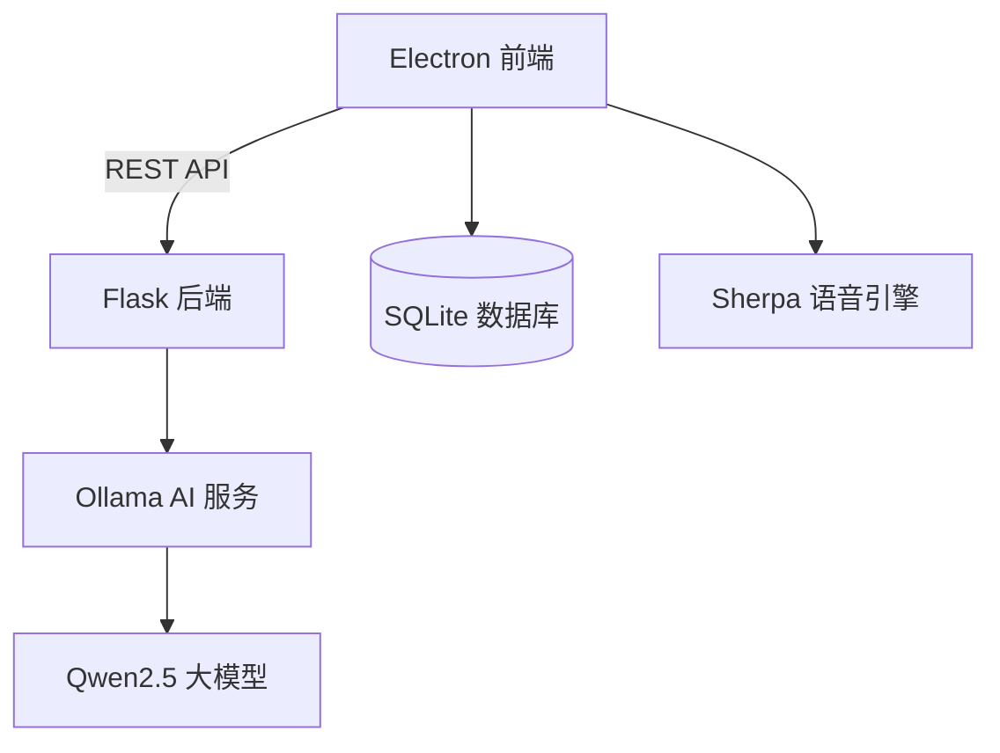

**技术栈**：
- **前端**: Vue 3 + TypeScript + Vite + Electron
- **后端**: Flask + Python 3.12
- **数据库**: SQLite3
- **AI 服务**: Ollama (Qwen2.5)

## 📸 功能预览

| 功能界面   | 预览                                   |
| ---------- | -------------------------------------- |
| 首页       | 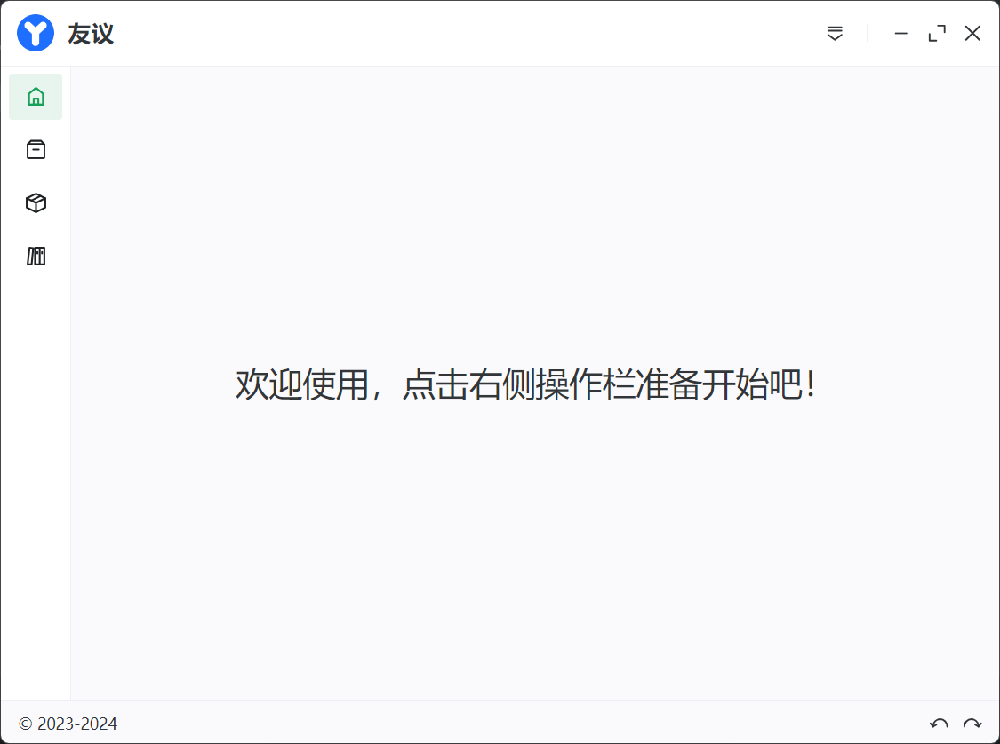             |
| 创建会议   | 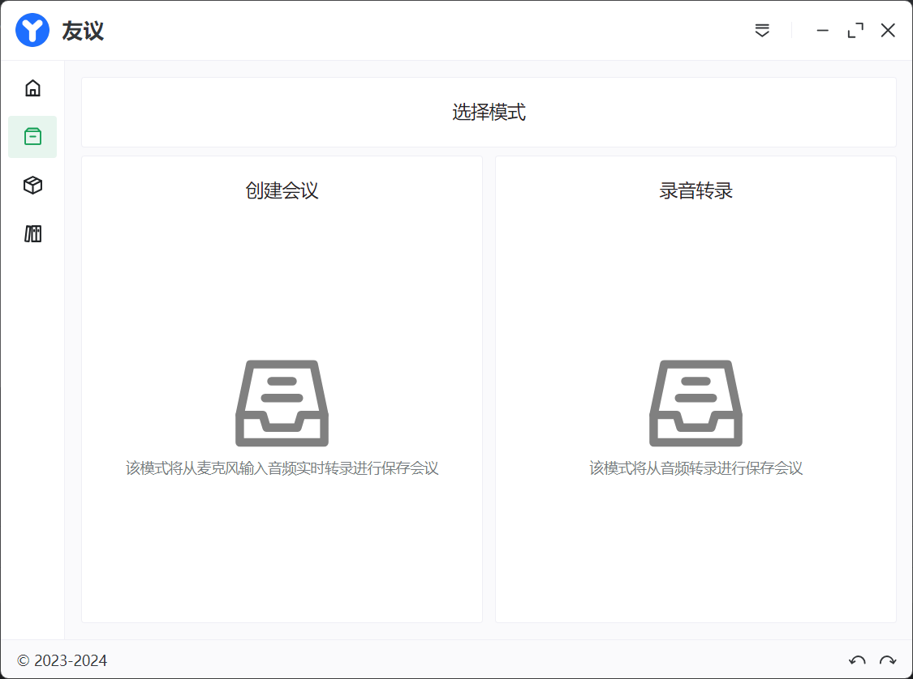         |
| 会议详情   | 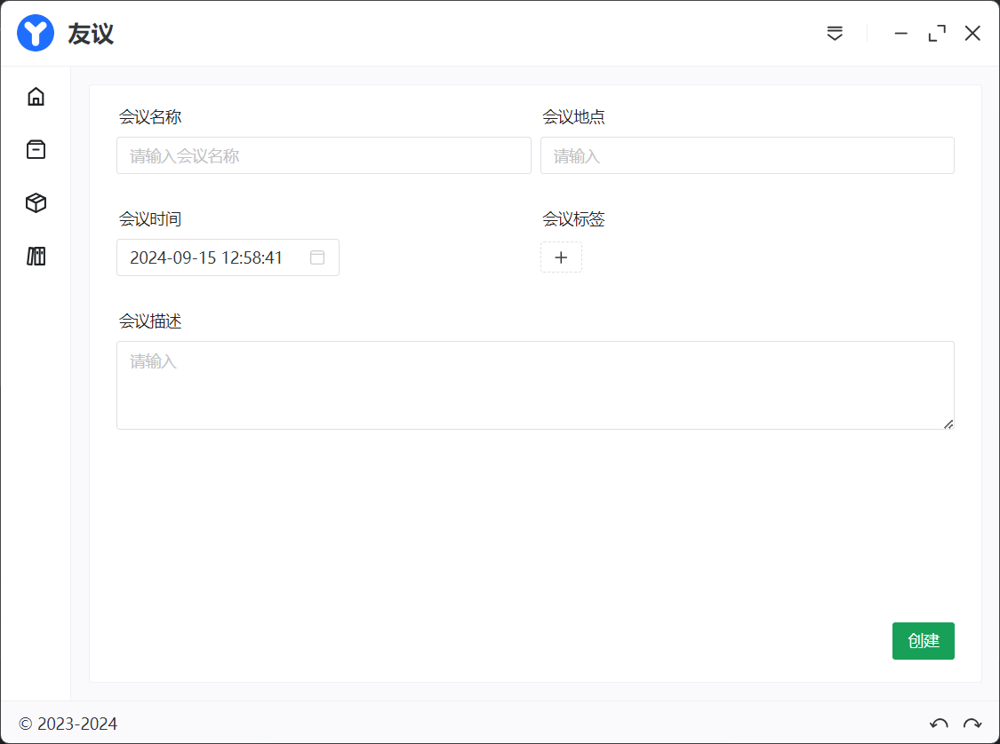     |
| 录音管理   | 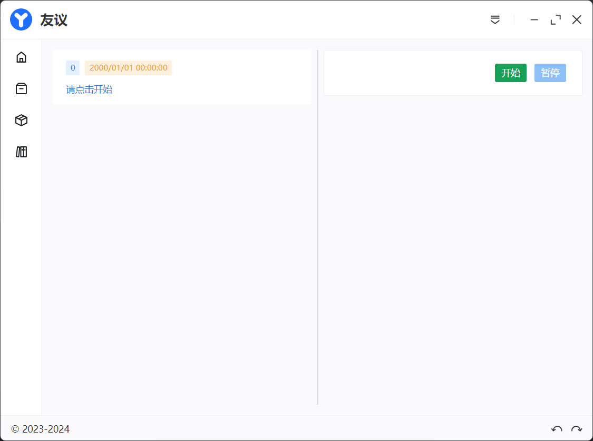         |
| 会议管理   | 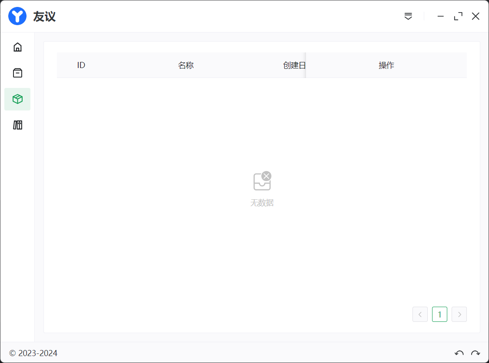 |
| AI摘要管理 | 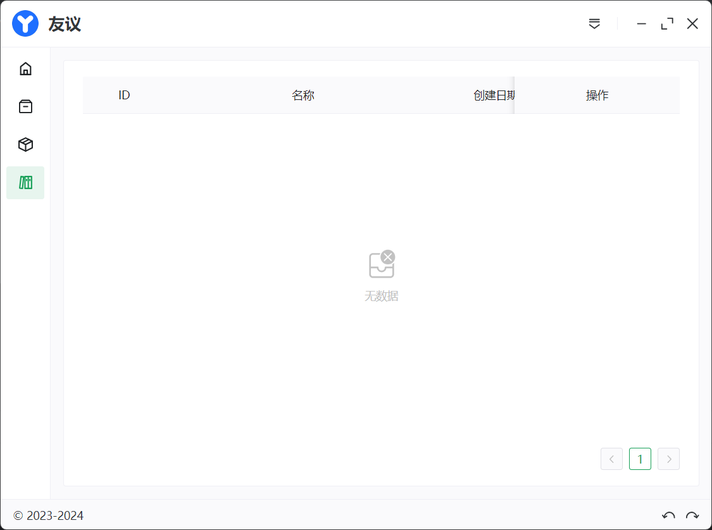       |

## 🛠️ 安装指南

### 系统要求
- Node.js v20.16.0+
- Python 3.12.4+
- C++ 编译环境 (Windows 需安装 VS Build Tools)
- Docker (如需使用Ollama)

### 1. 克隆仓库

```bash
# github
git clone git@github.com:charlie-zhang-code/youyi.git

# gitee
git clone git@gitee.com:charlie-zhang-code/youyi.git

cd youyi
```

### 2. 安装依赖

```bash
# 前端依赖
npm install

# 后端依赖
pip install -r requirements.txt
```

### 3. Sherpa 语音引擎配置

1. 从 [Sherpa 官方仓库](https://k2-fsa.github.io/sherpa/onnx/) 下载预编译模型
2. 将模型文件放入 `resources/sherpa_module/` 目录

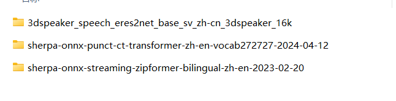

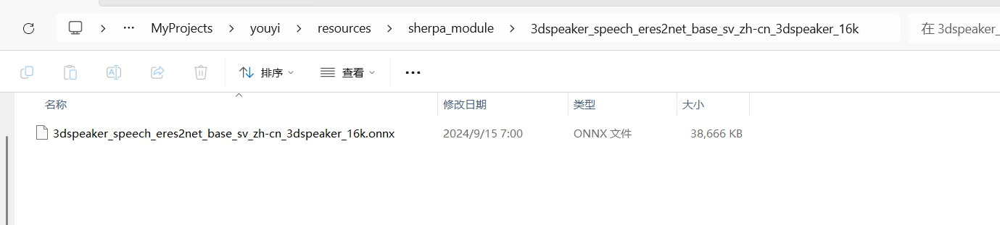

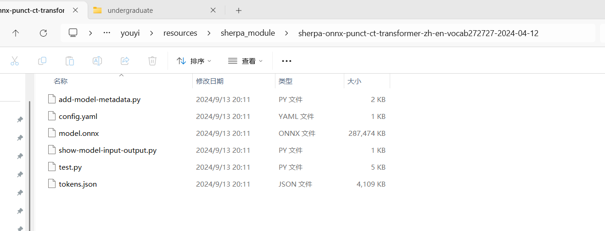

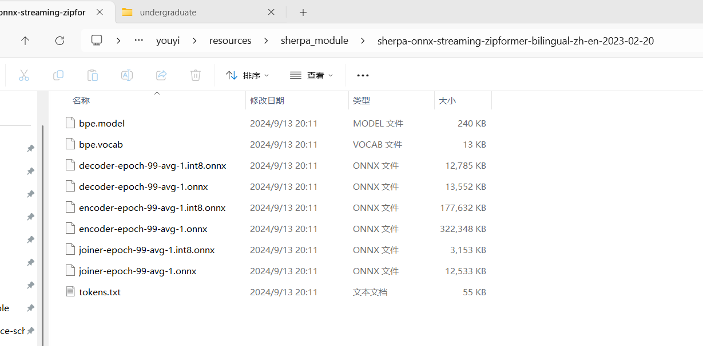

### 4. 前端额外编译步骤

#### better-sqlite3

> 基于 Node.js C++ 原生模块，需要编译 SQLite3 本地绑定

```bash
npm install better-sqlite3 --build-from-source
# 或全局安装编译工具后重装
npm install -g node-gyp
npm rebuild better-sqlite3
```

### 5. 运行应用

```bash
# 开发模式（前端）
npm run dev

# 启动后端
python main.py

# Ollama AI服务
docker run -d -p 11434:11434 --name ollama ollama/ollama
ollama run qwen2.5
```

## 🐛 已知问题

### 核心功能缺陷

1. **AI生成质量不足**：
   - 会议纪要生成过于简略，缺乏细节
   - 上下文关联性弱，段落间逻辑不连贯
   - 关键信息提取不完整，常遗漏重要讨论点
   - 缺乏多轮优化机制，生成结果单一

2. **参数调整问题**：
   - 语音识别参数固定，无法根据不同场景自适应调整
   - AI模型temperature参数未优化，导致生成内容随机性过强
   - 缺少生成长度控制，常出现内容过短或冗余

3. **上下文处理缺陷**：
   - 仅处理局部上下文，无法维护长程对话关系
   - 段落生成缺乏连贯性过渡

### 技术问题

1. **跨平台兼容性**：目前仅支持 Windows 操作系统，其他平台可能存在兼容性问题
2. **首次启动延迟**：初次启用语音识别时需要等待模型加载完成，耗时较长


## 🤝 贡献指南

欢迎开发者参与项目改进！以下是贡献步骤：

1. Fork 本项目
2. 创建特性分支 (`git checkout -b feature/your-feature`)
3. 提交更改 (`git commit -m 'Add some feature'`)
4. 推送到分支 (`git push origin feature/your-feature`)
5. 创建 Pull Request

## ❓ 常见问题

### Q1: Sherpa 文件缺失怎么办？

A: 需从官方仓库下载预编译模型，放置到指定目录。官方文档 [sherpa-onnx](https://k2-fsa.github.io/sherpa/onnx/)

### Q2: 前端本地模块编译失败？

A: 请检查：
1. Node.js 版本 ≥ v20.16.0
2. 已安装 Python 3.12 开发环境
3. 系统具备 C++ 编译工具链

### Q3: AI 服务连接异常

A: 确保：
1. Ollama 服务已启动
2. 已正确下载 Qwen2.5 模型
3. 防火墙未阻止 11434 端口


## 📜 许可证
MIT License © 2025 Charlie Zhang
